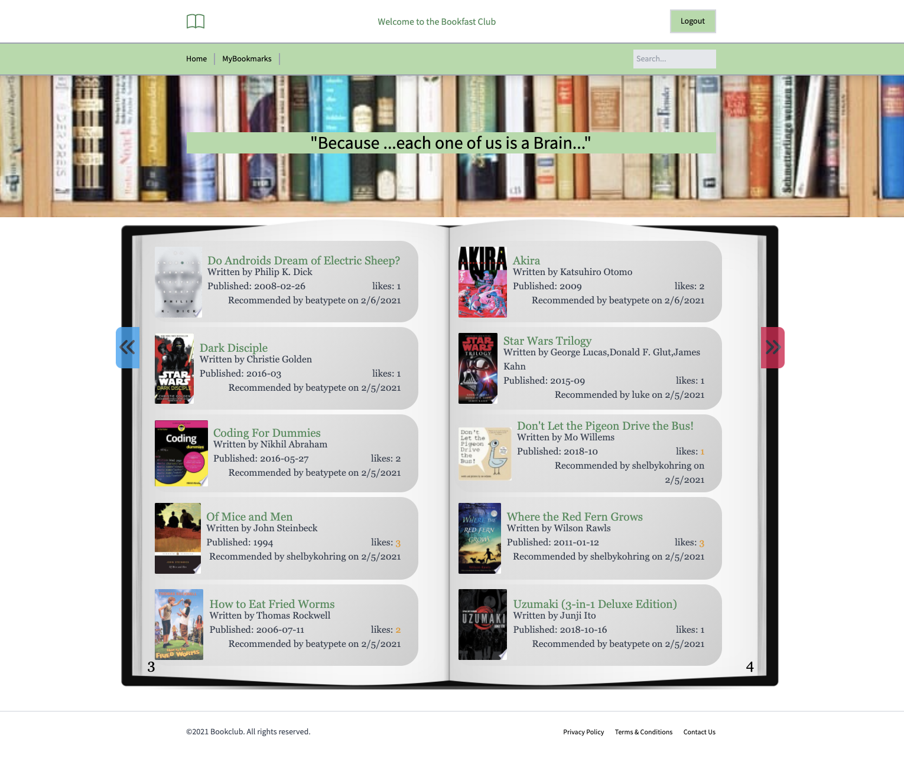

# The Bookfast Club

## Description
Ever needed a book recommendation from a close friend to keep up with them or a distant stranger to change things up and get a new perspective on the world of literature? Join the Bookfast Club and let us connect you. Create an account and have access to the following and so much more:
- See what books others are recommending 
- Create your own posts by recommending all the books you have read
- "Like" (👍) recommended books and see how many "Likes" (👍) your recommended books get
- Add recommended books to your own read list to help you decide what to read later
- Keep up with all of your own activity with the "My Bookmark" dashboard

Visit the deployed application and GitHub repository using the links below:

- [Access The Bookfast Club application here](https://the-bookfast-club.herokuapp.com/)

- [See the GitHub Repository for this application here](https://github.com/BeatyPete/the-bookfast-club.git)

## Table of Contents
- [Description](#description)
- [Technologies](#technologies)
- [Create an Account](#create-an-account)
- [Login and Logout](#login-and-logout)
- [Contributors](#contributors)
- [License](#license)
- [Questions](#questions)

## Technologies
This application is powered by the following technologies using HTML, CSS and JavaScript:
- TailwindCSS
- Handlebars
- jQuery
- Express
- MySql2
- Sequelize 
- Google Books API

## Create an Account
- [Access The Bookfast Club application using this link.](https://the-bookfast-club.herokuapp.com/)
- Click on the "Login" button.
- Click "Make an account instead" in the drop-down box to take you to the signup page.
- Enter all of your information and click the "Register" button.

## Login and Logout
- You can logout at any time using the "Logout" button.
- When you are ready to log back in, use the "Login" button and enter the email address and password you used when you created your account.

## Contributors
- Bruce Anthony II
- Brooklyn Bissinger
- Christian Bissinger
- Shelby Kohring
- Jack Novotny

## License 
 
- This application is covered under the MIT license.

## Questions
If you have questions about this application: 
- Visit our GitHub repository: [The Bookfast Club](https://github.com/BeatyPete/the-bookfast-club.git) 
